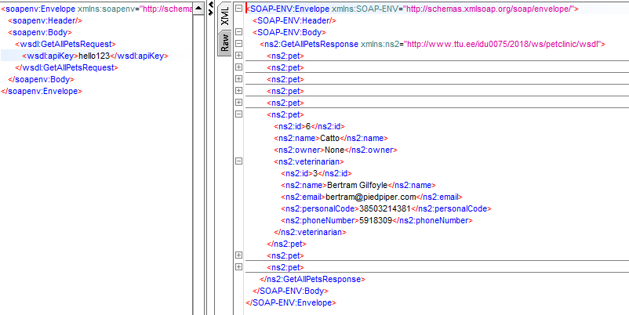
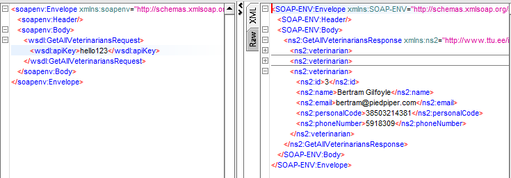
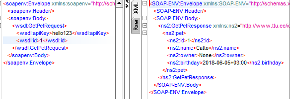
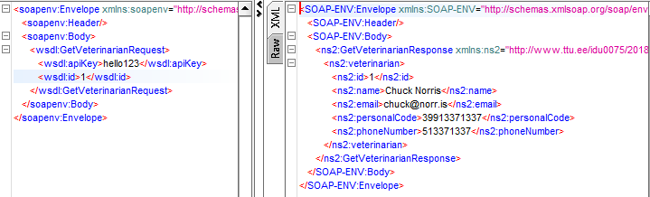
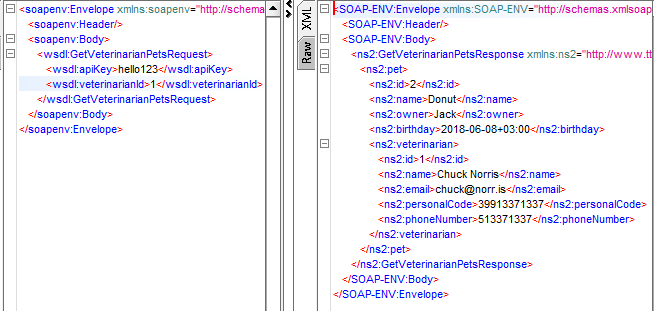
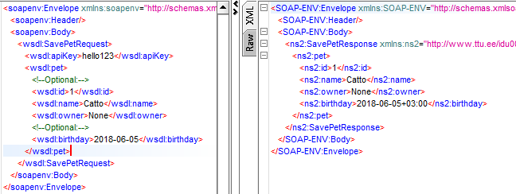
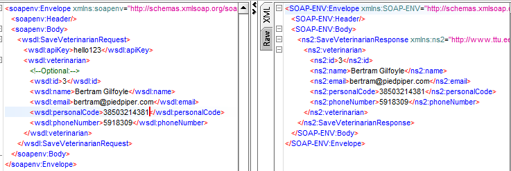
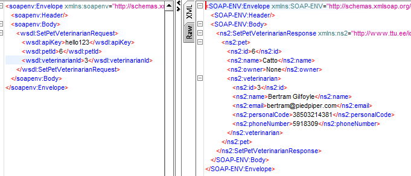
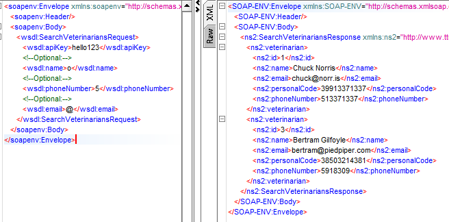

# PetClinic Service

> Web service for storing info about pets and their vets at a petclinic.


### Requirements

+ JDK 1.8
+ Gradle (Gradle wrapper is included)
+ MariaDB (It is extremely easy to switch to another database engine)


### Running

To run using development configuration:

```
./gradle bootRun -Dspring.profiles.active=dev
```

By default the application will start on port `8080`

Swagger UI will be available on http://localhost:8080/swagger-ui.html

WSDL will be available on http://localhost:8080/ws/PetClinicWebService.wsdl


### Introduction

Pets and Veterinarians are persisted into a relational database using Hibernate (JPA). For SOAP services, the datamodel schema is located in `src/main/resources/WebServiceModelSchema.xsd`

SOAP services use classes generated from the XSD file.

REST services and everything below the controller layer uses POJO-s that are manually written (not generated from XSD, as those can't be persisted into the database).


### Service

Service consists of two REST controllers and two SOAP endpoints.

Service consists of two main types of objects: `Pet` and `Veterinarian`.

There is a Many-to-One relation between `Pet` and `Veterinarian`

#### `Veterinarian`

Veterinarian has following properties:

+ ID
+ Name
+ Email
+ Phone number
+ Personal code (Estonian personal code, etc.)

#### `Pet`

Pet has following properties:

+ ID
+ Name
+ Owner (name of the owner for simplification)
+ Birthday (Can be null if unknown)
+ Veterinarian - the veterinarian responible for making sure that this pet is as healthy as possible


### SOAP

The SOAP service consists of 8 operations.

All SOAP requests require a API key to be set. The key can beset in active `application.properties` configuration.

##### GetAllPets

> Return a list of all pets registered with their veterinarians.




##### GetAllVeterinarians

> Return a list of all veterinarians in the clinic.




##### GetPet

> Return a pet with corresponding ID if it exists.




##### GetVeterinarian

> Return a veterinarian with corresponding ID if he/she exists.




##### GetVeterinarianPets

> Return a list of pets that visit veterinarian with given ID.




##### SavePet

> Save pet. If ID conflicts with an existing pet, the existing record will get overwritten.




##### SaveVeterinarian

> Save veterinarian. If ID conflicts with an existing veterinarian, the existing record will get overwritten.




##### SetPetVeterinarian

> Set a veterinarian for a pet, if both with given ID-s exist.




##### SearchVeterinarians

> Search for veterinarians. Vets can be filtered by name, email and phone number. All the parameters are optional. A vet matches if his/her property contains corresponding search argument.




### REST

The documentation for REST service will get automagically generated and will be available on the URL mentioned before.

An API key is required for authentication. It should be sent as the `Authorization` header.

Postman collection with example requests can be [here](https://documenter.getpostman.com/view/2819899/petclinic/RW8FGmhX#a5cb3672-f329-bf96-53d7-2f3c0a44f9d7). It is also included in the repository.